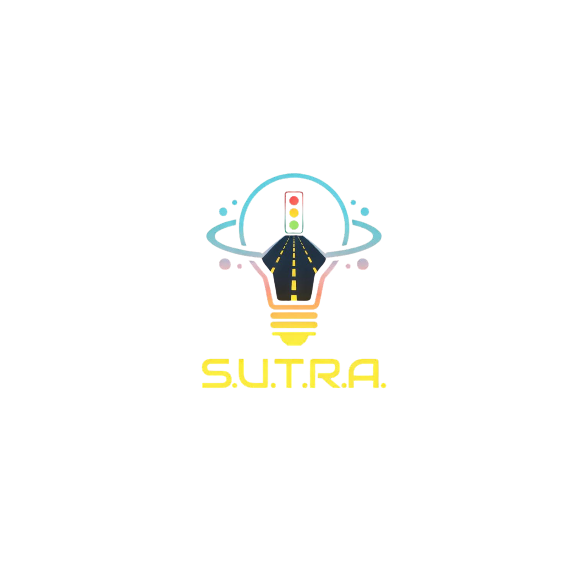

<p align="center">
  
</p>
# 🚦 S.U.T.R.A. — Smart Urban Traffic & Response Architecture
### **MOVING TRAFFIC | SAVING LIVES**

**S.U.T.R.A.** is a decentralized, Edge-AI traffic management node designed to bring order to urban chaos. Unlike traditional blind timers, S.U.T.R.A. utilizes multi-modal sensor fusion—combining real-time computer vision and advanced acoustic processing—to manage traffic flow, clear paths for emergency vehicles, and protect citizen safety.

## 🚀 Key Technical Features

* **Acoustic Siren Recognition (EVP):** Employs advanced Fourier Transform (FFT) and Z-score tonality filtering to isolate emergency sirens from ambient city noise, triggering an immediate "Green Corridor".
* **Proximity-Based Accident Detection:** Uses a geometric proximity matrix (Shapely math) with configurable spatial padding (e.g., 40px) to detect collisions, specifically optimized for high-accuracy hackathon demonstrations with toy cars.
* **Guardian Angel (SOS Signal):** Monitors the international "Signal for Help" hand gesture (Palm → Tuck Thumb → Make Fist) via MediaPipe to silently dispatch emergency services.
* **Dynamic UI Overlays:** Features high-impact, on-video AR overlays including pulsing critical borders and real-time status alerts for instant visual feedback during emergencies.
* **India-Specific Intelligence:** Includes "Project Nandi" for animal hazard detection and a specialized "Festival Mode" for routing religious processions.
* **Smart Dashboard Architecture:** Features a modular Command Center with dedicated auto-spawning tabs for Multi-Emergency alerts (Ambulance + Accident) and Festival Mode.

## 🛠️ Tech Stack

* **Backend:** Python, Flask (Threaded Architecture)
* **AI/Vision:** Ultralytics YOLOv8, MediaPipe
* **Math & Geometry:** Shapely (Collision hitboxes), NumPy
* **Signal Processing:** SciPy (Butterworth Bandpass Filtering), SoundDevice
* **Frontend:** HTML5, JavaScript (Async Polling), CSS3 (Modern Dark Matrix UI)

## 📦 Setup & Installation

1.  **Clone the Repository:**
    ```bash
    git clone (https://github.com/NishadPatil008/S.U.T.R.A.-Moving-Traffic-Saving-Lives.git)
    cd S.U.T.R.A.-Moving-Traffic-Saving-Lives
    ```

2.  **Install Dependencies:**
    ```bash
    python -m pip install -r requirements.txt
    ```

3.  **Asset Check:** Ensure your project logo is placed at `static/logo.png`.

4.  **Run the Node:**
    ```bash
    python app.py
    ```

## ⚙️ Configuration (`config.json`)

| Section | Key | Description |
| :--- | :--- | :--- |
| **camera** | `index` | Webcam hardware ID (default `0`). |
| **model** | `confidence` | AI detection threshold (default `0.55`). |
| **acoustic** | `amplitude_threshold` | Sensitivity for siren detection. |
| **accident** | **`collision_padding`** | **CRITICAL:** Artificially grows hitboxes by N pixels. Increase this (e.g., `40` to `60`) for better toy car collision detection. |
| **accident** | `iou_threshold` | Overlap percentage required for a crash alert. |

## 🕹️ Command Center Terminal

Use the integrated AI Command Panel on the dashboard to control the node live:

* `/help` — Displays a detailed manual of all available commands and their uses.
* `/events` — View the complete log of system incidents (Accidents, SOS, etc.).
* `/demo` — Toggle the automated Auto-Pilot presentation cycle for judging.
* `/config` — View current JSON backend parameters.
* `/reload` — Hot-swap changes made to `config.json` without restarting the server.

## 📄 License

This project is licensed under the GPL-3.0 License.

**Copyright (c) 2026 Nishad Patil, Sandesh Kotwal, Arnav Awatipatil, Sai Chavan, and Devdatta Shahane.**
Students of **MIT World Peace University (MIT-WPU), Kothrud, Pune**.
Integrated B.Tech Second Year.

* **Nishad Patil** (Team Lead) — Computer Science Engineering (CSE)
* **Sandesh Kotwal** — Computer Science Engineering (CSE)
* **Arnav Awatipatil** — Computer Science Engineering (CSE)
* **Sai Chavan** — Computer Science Engineering (CSE)
* **Devdatta Shahane** — Mechanical Engineering (ME)
  
## 📂 Project Structure

```text
/SUTRA-Project
│
├── app.py              # Main AI Engine & Flask Backend
├── config.json         # Live configuration parameters
├── recordings/         # Auto-saved incident MP4 clips
├── static/             # Assets (CSS, JS, and logo.png)
├── templates/          # Dashboard UI (index.html)
└── yolov8s.pt          # AI Model Weights

