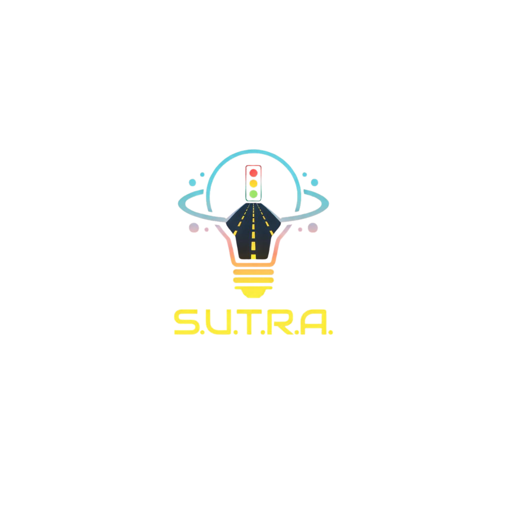

# 🚦 S.U.T.R.A. — Smart Urban Traffic & Response Architecture
### **MOVING TRAFFIC | SAVING LIVES**

**S.U.T.R.A.** is a decentralized, Edge-AI traffic management node designed to bring order to urban chaos. Unlike traditional blind timers, S.U.T.R.A. utilizes multi-modal sensor fusion—combining real-time computer vision and advanced acoustic processing—to dynamically manage traffic flow, instantly clear paths for emergency vehicles, and protect citizen safety.

## 🚀 Key Technical Features

* **Instant Emergency Preemption (EVP):** Utilizes YOLOv8 Vision to detect emergency vehicles. The system actively calculates bounding box area to identify the single largest emergency proxy (ignoring background traffic) and instantly forces the lane to a GREEN signal, bypassing normal delay cycles.
* **Strict Multi-Modal Fusion:** A configurable "Strict Mode" that requires *both* visual confirmation of an ambulance AND acoustic confirmation of a siren before overriding the signal, preventing false positives.
* **Acoustic Siren Recognition:** Employs Fast Fourier Transform (FFT) and Z-score tonality filtering via SciPy to isolate emergency sirens from ambient city noise(adjust sound freq from config).
* **Guardian Angel (SOS Signal):** Monitors the international "Signal for Help" hand gesture (Palm → Tuck Thumb → Make Fist) via MediaPipe to silently log distress events and alert authorities.
* **India-Specific Intelligence:** Includes "Project Nandi" for animal hazard detection and a specialized "Festival Mode" (with an auto-spawning UI tab) for accommodating religious processions without breaking traffic flow.
* **Interactive UI & Persistence:** Features a highly modern Dark Matrix UI with an interactive `/demo` tutorial sequence. The dashboard uses browser `localStorage` to perfectly remember your last loaded media feed even if the page refreshes.

## 🛠️ Tech Stack


* **AI/Vision:** Ultralytics YOLOv8, Google MediaPipe, OpenCV
* **Signal Processing:** SciPy (Butterworth Bandpass Filtering), SoundDevice, NumPy
* **Frontend:** HTML5, JavaScript (Async Polling, LocalStorage), CSS3

## 📋 Prerequisites & System Requirements

Before running the system, ensure your hardware and software meet the following detailed specifications:

* **Python Version:** **Python 3.9.x, 3.10.x, or 3.11.x is strictly required.** *(Note: Python 3.12+ is not recommended as certain dependencies like MediaPipe and SoundDevice may lack stable pre-compiled wheels for newer Python versions).*
* **Hardware:** * A functioning Webcam (or virtual camera software like OBS) for the vision feed.
  * A working Microphone for the Acoustic Sensor (EVP) module to detect sirens.
* **OS:** Windows 10/11, macOS, or Ubuntu/Linux.

## 📦 Setup & Installation

1.  **Clone the Repository:**
    ```bash
    git clone [https://github.com/NishadPatil008/S.U.T.R.A.-Moving-Traffic-Saving-Lives.git](https://github.com/NishadPatil008/S.U.T.R.A.-Moving-Traffic-Saving-Lives.git)
    cd S.U.T.R.A.-Moving-Traffic-Saving-Lives
    ```

2.  **Verify Python Version:**
    ```bash
    python --version
    # Ensure this outputs a version between 3.9.0 and 3.11.x
    ```

3.  **Install Dependencies:**
    It is recommended to use a virtual environment (`venv` or `conda`).
    ```bash
    python -m pip install --upgrade pip
    python -m pip install -r requirements.txt
    ```

4.  **Asset Check:** * Ensure your project logo is placed at `static/logo.png`. 
    * Ensure your media files are placed in their respective `static/images/`, `static/videos/`, and `static/sounds/` folders.

5.  **Run the Node:**
    ```bash
    python app.py
    ```
    *Once running, open your web browser and navigate to `http://localhost:5000` or `http://127.0.0.1:5000`.*

## ⚙️ Configuration (`config.json`)

The system's core behavior can be tweaked without changing the Python code by editing `config.json`:

| Section | Key | Description |
| :--- | :--- | :--- |
| **camera** | `index` | Webcam hardware ID (default `0`). Change to `1` or `2` for external USB cameras. |
| **model** | `confidence` | AI detection threshold (default `0.55`). Dropped to `0.25` internally for deep background traffic processing. |
| **audio** | `chunk_seconds` | The buffer length of audio processed per cycle (default `0.4`). |
| **siren_detection** | `amplitude_threshold` | Sensitivity for isolating siren peaks from background noise (default `25.0`). |
| **traffic_controller** | `max_green` | The maximum dynamic extension time given to heavy traffic lanes (default `25.0` seconds). |

## 🕹️ Command Center Terminal

Use the integrated AI Command Panel located in the center of the dashboard to dynamically control the node during live presentations:

* `/demo` — Launches the **Interactive UI Dashboard Tour**, which physically highlights cards, dims the background, and explains features step-by-step to the judges.
* `/use image` — Scans the `static/images/` folder and lists available static testing scenarios. Type the corresponding number to load it (e.g., load `amb.jpg` to instantly trigger the Green Signal override).
* `/use video` — Scans the `static/videos/` folder and loads a local video traffic dataset.
* `/use audio` — Scans the `static/sounds/` folder, actively loads the audio file into the Acoustic Sensor panel, and allows you to manually press play to test FFT siren detection.
* `/use camera` — Instantly hot-swaps the feed back to your live hardware webcam.
* `/help` — Displays a detailed in-app manual of all available commands.


## 📄 License
This project is licensed under the GNU General Public License v3.0 (GPL-3.0).

Permissions of this strong copyleft license are conditioned on making available complete source code of licensed works and modifications, which include larger works using a licensed work, under the same license. Copyright and license notices must be preserved. Contributors provide an express grant of patent rights.

Copyright (c) 2026 Nishad Patil, Sandesh Kotwal, Arnav Awatipatil, Sai Chavan, and Devdatta Shahane.
Students of MIT World Peace University (MIT-WPU), Kothrud, Pune.
Integrated B.Tech Second Year.

Nishad Patil (Team Lead) — Computer Science Engineering (CSE)

Sandesh Kotwal — Computer Science Engineering (CSE)

Arnav Awatipatil — Computer Science Engineering (CSE)

Sai Chavan — Computer Science Engineering (CSE)

Devdatta Shahane — Mechanical Engineering (ME)


## 📂 Project Structure

```text
/SUTRA-Project
│
├── app.py              # Main AI Engine, Background Worker & Flask Backend
├── config.json         # Live configuration parameters
├── requirements.txt    # Python dependencies list
├── static/             # Assets (CSS, JS, logo.png)
│   ├── images/         # Storage for static testing images (e.g., amb.jpg)
│   ├── videos/         # Storage for traffic mp4 datasets
│   └── sounds/         # Storage for siren testing (e.g., siren.mp3)
├── templates/          
│   └── index.html      # Dashboard User Interface
└── yolov8s.pt          # AI Model Weights (Downloads automatically if missing)
